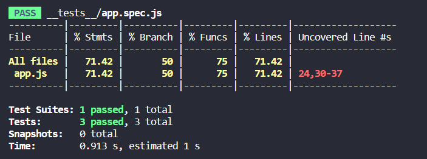
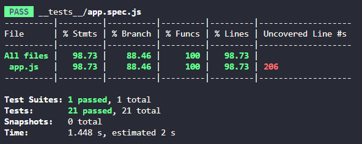
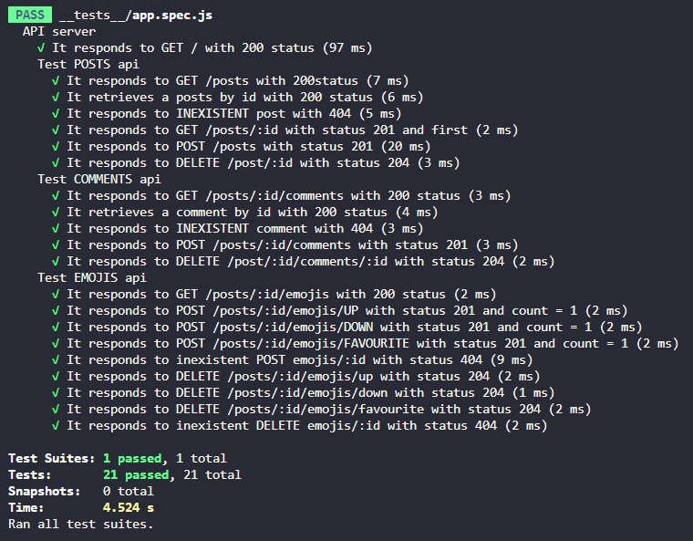

# **Granny Smith's Server Side**

### **Community Journaling Website - futureproof LAP 1 Protfolio Project**

Project consists in creating a Community Journaling Website on which:

Users should be able to visit the website and anonymously post journal entries, add gifs from [giphy](https://developers.giphy.com/) in an entry, be limited to how many characters they can put in an entry. They should also be able to view, comment and react with an emoji to other peoples' entries. Having three emojis to choose from.
The Website shouldn't have a database connected, instead any data sent and stored in the backend should be saved within .json files.

### **Installation**

- Clone or download the [Server repo](https://granny-smith-server.herokuapp.com/).
- Run ```npm init -y```.
- Install extra modules as per set up instructions.
- Run ```npm run dev```.

The [deployed server](https://granny-smith-server.herokuapp.com/) can be accessed on Heroku.

## **View from Server Side - Process**

As all data would be stored on server it was clear that the server itself would be responsible to embed all functions that permit client to *Access, Retrieve, Create and Delete* data from database. That is, an *API*. 

Considering all functionalities we wanted on out website and working together, front and back decided the basic data structure would be as demonstrated below. For the present project, it was also agreed that only one json file would suffice to storage all required data.

```json
{
  "general": {
    "squadName": "The Granny Smiths"
  },
  "posts": [
    {
      "id": "1",
      "title": "text",
      "description": "text",
      "content": "text",
      "gif": "url",
      "emojis": [{
          "up": 0,
          "down": 0,
          "favourite": 0
        }],
      "comments": [{
          "id":"1",
        "message": "text"
        }]
    }
  ]
}
```
Our server enables client to access Posts, Comments and Emojis *separately*. As well as accessing specific posts or comments and counting emojis. To do so, eight routes were created. They were:

- /posts
- /posts/id
- /posts/id/comments
- /posts/id/comments/id
- /posts/id/emojis
- /posts/id/emojis/${up, down or favourite}

For each option above we had to create a *Get, Post and Delete* function. Here is an example of GET posts function which returns a 404 status if the post doesn't exist. The required parameter passed as id is a number.

```javascript
app.get('/posts/:id', (req, res) => {
    
    if (data.posts[req.params.id-1]) {
        res.json(data.posts[req.params.id-1])
       
    } else {

      res.status(404).send({error: `Choose a number between 1 and ${data.posts.length}`})

      }
    })
  ```
All those features were essential to guarantee client would have access to all resources due to achieve the planned result.

### **Test Results**

We opted for Jest and Supertest. We also used Coverage to guarantee we had a minimun of 60% of our code covered. 

We started testing very early to make sure since the beggining, things were running as planned. 



By the end of the project as you may see bellow, we have achieved a great result convering all functions and almost all lines.





### **Wins and Challenges**

Everytime a post or comment created or deleted from website will be updated on our database. Everytime an emoji is clicked or unclicked it will be counted. With this we prevented client to crash trying to retrieve unexisting post id after deletion. We also prevent posts or comments to be stored with same id value. Below is an example of delete function which contains an for loop that processes and update the posts id's.

```javascript
app.delete('/posts/:id', (req, res) => {
  
  const postIdx = parseInt(req.params.id) -1

  data.posts.splice(postIdx,1)
  
  for (i=0; i<data.posts.length; i++){
      data.posts[i].id = (i+1).toString();
  }
  res.status(204).send();
})
```
Another solution we came up with is the code below which is used to rewrite the Json file everytime a post or delete function is called. This way we can guarantee our database will keep all changes even if the server goes down for any reason.

```javascript
fs.writeFile(fileName, JSON.stringify(data, null, 2), function writeJSON(err) {
    if (err) return console.log(err);
    console.log(JSON.stringify(data, null, 2));
    console.log('writing to ' + fileName);
  });
```
## **Server Set Up**

Tools, technologies, installation and usage.

### **Express.js and Cors**

[Express.js](https://expressjs.com/) is the most popular web framework for Node.js. It is designed for building web applications and APIs. It provides methods to specify what function is called for a particular HTTP verb (GET, POST, PUT, etc.) and URL pattern (Route). An exmaple of a Express route is demonstrated in the code below. Here, Express is declaring that all GET requests made to the route, /, will be handled with a function that responds to the client with “Hello World!”. [CORS](https://github.com/expressjs/cors) is a node.js package for providing a Express middleware that can be used to enable [Cross-origin resource sharing](https://en.wikipedia.org/wiki/Cross-origin_resource_sharing) with various options.

Installation
```
$ npm install express
```
```
$ npm install cors
```
Simple Usage
```javascript
  const express = require('express')
  const app = express()
  const cors = require('cors')

  app.use(cors())
  app.use(express.json())

  app.get('/', (req, res) => {
      res.send('Hello World') //This is CORS-enabled for all origins
  })
```

### **Nodemon**

[nodemon](https://www.npmjs.com/package/nodemon) is a tool that helps develop Node.js based applications by automatically restarting the node application when file changes in the directory are detected.

Installation
```
 $ npm install --save-dev nodemon
```
## **Tests Set Up** 

### **Jest and Supertest**

[Jest](https://jestjs.io/) is a JavaScript Testing Framework with a focus on simplicity and support for large web application which works with projects using Node.js, React, Angular and others. [Supertest](https://www.npmjs.com/package/supertest) is a Node.js library that helps developers test APIs. It can be used as a standalone library or with JavaScript testing frameqorks such as Jest.

Installation
```
$ npm install supertest --save-dev
```
```
$ npm install --save-dev jest
```
Simple Usage
```javascript
const request = require('supertest')
const express = require('express')
const app = express()

it('It responds to POST /posts with status 201', (done) => {
    request(api)
    .post('/posts')
    .send (testPost)
    .set('Accept', /application\/json/)
    .expect(201)
    .expect({id: '3', ...testPost, emojis: [], comments: []},done)
    })
```
### **Coverage**

[Coverage](https://www.npmjs.com/package/coverage) is a command line tool to collect and report code coverage of JavaScript programs.

Installation
```
$ npm install coverage
```

### **Package.json's dependencies and scripts after all set ups completed.**
```json
  "scripts": {
    "test": "jest --watchAll",
    "dev": "nodemon server.js",
    "coverage": "jest --coverage --silent"
  },
  "devDependencies": {
    "jest": "^29.0.0",
    "nodemon": "^2.0.19",
    "supertest": "^6.2.4"
  },
  "dependencies": {
    "cors": "^2.8.5",
    "coverage": "^0.4.1",
    "express": "^4.18.1"
  }
```

## **Other Tools and Technologies**

To check server's functionalities we used [Hoppscotch](https://hoppscotch.io/), an open source API development ecosystem.

To deploy our server we used [Heroku](https://www.heroku.com/), a cloud plataform.

As version control system we used [Git](https://git-scm.com/) and, as a hosting service [GitHub](https://github.com/).

We use JavaScript as main programming language and Json as data format.

Our main communication has occurred via [Slack](https://slack.com/intl/en-gb/) and Zoom.

Our action planning has been done via [Trello](https://trello.com/)

### License

## 

### **Contributers**

[Matthew Blackman](https://github.com/ultimafinal1)

[Camila Pessoa](https://github.com/Nevashka)

[Karl Dudley](https://github.com/karldudley)

### **Bibliography**

- https://www.codecademy.com/article/what-is-express-js
- https://github.com/expressjs/cors
- https://www.npmjs.com/package/nodemon
- https://jestjs.io/
- https://www.npmjs.com/package/coverage
- https://www.testim.io/blog/supertest-how-to-test-apis-like-a-pro/
- https://www.npmjs.com/package/supertest
- https://docs.github.com/en/get-started/writing-on-github/getting-started-with-writing-and-formatting-on-github/basic-writing-and-formatting-syntax#images
- https://medium.com/@perrysetgo/what-exactly-is-an-api-69f36968a41f#:~:text=Application%20Programming%20Interface%20(API)&text=The%20API%20is%20not%20the,that%20can%20access%20a%20database
- https://http.cat/

